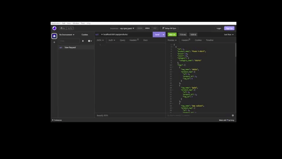
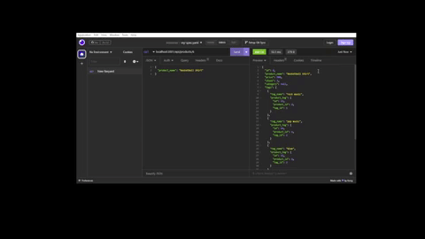
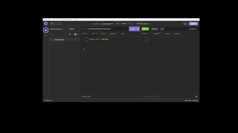

# E-commerce Back End
<h1 align="center">E-Commerce Back End</h1>

    
    
    
    

## Description 💾

## User Story ✉️
~~~
AS A manager at an internet retail company
I WANT a back end for my e-commerce website that uses the latest technologies
SO THAT my company can compete with other e-commerce companies
~~~
## Acceptance Criteria 📩
~~~
GIVEN a functional Express.js API
WHEN I add my database name, MySQL username, and MySQL password to an environment variable file
THEN I am able to connect to a database using Sequelize
WHEN I enter schema and seed commands
THEN a development database is created and is seeded with test data
WHEN I enter the command to invoke the application
THEN my server is started and the Sequelize models are synced to the MySQL database
WHEN I open API GET routes in Insomnia Core for categories, products, or tags
THEN the data for each of these routes is displayed in a formatted JSON
WHEN I test API POST, PUT, and DELETE routes in Insomnia Core
THEN I am able to successfully create, update, and delete data in my database
~~~
## Table of Contents 🔍
* [Installation](#installation-)
* [VideoLink](#video-)
* [Usage](#usage-)
* [Questions](#questions-)
* [License](#license)

## Installation 🔨
To use this application direct to the git repo, git clone the repo down to your local.

Direct to the `Develop` folder. 

Run `npm install` or `npm i` in order to install the following npm package,

* [`nodemon`](https://www.npmjs.com/package/nodemon)
* [`express`](https://www.npmjs.com/package/express)
* [`dotenv`](https://www.npmjs.com/package/dotenv)
* [`mysql2`](https://www.npmjs.com/package/mysql2)
* [`sequelize`](https://www.npmjs.com/package/sequelize)

Create an `.env` file, then fill out the required details.

Direct to the db file and `source schema.sql`

Then run `npm run seed` to import existing database.

Finally, you can run `npm start` to run the application.

## Video

## Usage 💡

## License
MIT License

## Questions ❓
For any additional questions, please reach out to: jaecho203@gmail.com or visit [slchld1](https://github.com/slchld1) on GitHub! Thank you.